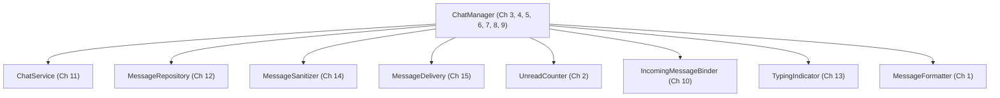

# Introduction: The Message Metaphor

---

## The Core Idea

Think of every method call as sending a message to an object. The object receives the message, does something, and the world changes in some way — or it does not.

When you test a method, you are asking one of three questions:

1. **What does it send back?** — The method returns a value. You verify the return value.
2. **What does it change inside itself?** — The method modifies the object's own state. You verify the state after the call.
3. **What does it tell others to do?** — The method calls methods on other objects. You verify those outgoing calls.

Every unit test pattern in this catalog is a specific answer to one of these three questions. Master the questions, and the patterns follow naturally.

---

## What to Test

For each method in your code, ask:

- What should the object **return** when it receives this message?
- What should change in the object's **internal state**?
- What **other messages** should the object send as a result?

Testing these three things gives you complete coverage of a method's observable behavior.

---

## Which Outgoing Messages to Verify

The third question needs one refinement. Outgoing messages come in two kinds:

- A **query** asks another object for something and changes nothing — `cache.getCachedMessage(id)`, `network.get('/messages')`.
- A **command** tells another object to do something that has an effect — `analytics.logEvent(...)`, `storage.persist(...)`, `network.post(...)`.

**Verify outgoing commands. Do not verify outgoing queries.**

A command's effect happens somewhere else, so the only place a unit test can see it is at the boundary: record the call with a mock and assert it was made with the right arguments. A query's effect shows up in your own object — in what it returns or how its state changes — so assert there instead, and give the collaborator a stub that simply answers. Asserting that a query was made ties the test to *how* the object gets its information rather than *what* it does with it, and the test breaks the moment the implementation caches, batches, or reorders its lookups.

The full rule, message by message:

| Message | What the test asserts on | Chapter |
|---|---|---|
| Incoming query | The return value | 1 |
| Incoming command | The object's public state afterwards | 2 |
| Outgoing command | The call itself, recorded by a mock | 3, 4 |
| Outgoing query | Nothing — stub it, then assert on what the object does with the answer | 11, 12 |
| Message to self (private method) | Nothing — it is covered through the public messages that use it | — |

[Chapter 11](../chapter11_third_party_integration/README.md) shows the rule in a single file: `StubNetworkService` answers `get` and is never asserted on, while `MockNetworkService` records `post` and is.

---

## What This Catalog Does Not Cover

This catalog describes *what* to verify and *how* to structure the test for each category of behavior. The question of *when* to write tests relative to the production code — before (test-first), after (test-last), or interleaved — is a workflow decision that sits outside the scope of this catalog. Different teams and practitioners make different choices here, and the patterns work regardless of that choice.

---

## Why to Test

By verifying these behaviors independently, you ensure that each class fulfills its contract precisely. If every class does what it promises, the system composed of those classes is reliable. Unit tests are the mechanism for making that promise verifiable and automatic.

---

## A Note on Language

The patterns in this catalog are not about Dart. Dart and Flutter are the reference implementation — the language the catalog happens to be written in — not its subject. Every Intent, Problem, Forces, and Consequences section is written to hold in any object-oriented language; only the Solution code and the Implementation Notes are Dart-specific, the same split the Gang of Four made between their patterns and their C++ and Smalltalk samples.

Most chapters translate directly. A few map onto different mechanics — Dart's `Completer` becomes a checked continuation in Swift, Dart's sealed classes become enums with associated values, Dart's `fakeAsync` becomes an injected clock. Where a chapter's advice depends on a Dart feature rather than on the pattern, its Implementation Notes say so.

---

## How to Test in Dart

Dart tests use `package:flutter_test` (or `package:test` for pure Dart). The fundamental structure:

```dart
import 'package:flutter_test/flutter_test.dart';

void main() {
  group('ClassName', () {
    late ClassName subject;

    setUp(() {
      subject = ClassName();
    });

    test('describes the expected behavior', () {
      // Arrange — set up the scenario
      // Act — send the message
      // Assert — verify what happened
      expect(subject.someMethod(), equals(expectedValue));
    });
  });
}
```

The three-part Arrange / Act / Assert structure maps directly to the three questions above:

| Test part | What it does |
|---|---|
| **Arrange** | Put the object in a known state before sending the message |
| **Act** | Send the message (call the method) |
| **Assert** | Verify return value, state change, or outgoing messages |

---

## A Note on Code Structure

From Chapter 4 onward, every pattern in this catalog requires that the class under test *receives* its dependencies through the constructor rather than creating them internally. If you encounter a class that creates its own dependencies (e.g. `final _analytics = FirebaseAnalytics()`) and are not sure how to restructure it, see [Designing for Testability](../appendix/designing-for-testability.md) before proceeding.

---

## The Running Example: A Chat App

Throughout this catalog, every chapter is anchored to the same imagined application — a small chat client — so the catalog reads as one continuous story instead of fifteen disconnected examples. The patterns are general; the domain just gives them a shared shape.

The chat domain is small enough to hold in your head and rich enough to exercise every pattern:



The arrows above describe the *app's* shape — not chapter dependencies. Each chapter's `code/` folder is self-contained: you can read Chapter 8 without having read Chapter 4. The names and the domain context line up across chapters so that the patterns reinforce each other, but each test you read stands on its own.

### Domain Map

| Class | Role in the chat app | Chapter |
|---|---|---|
| `MessageFormatter` | Pure helper: relative-time labels, message previews | 1 |
| `UnreadCounter` | Per-conversation badge state | 2 |
| `ChatManager` | The send/receive pipeline, configured differently per chapter | 3–9 |
| `IncomingMessageBinder` | Owns the stream subscriptions for a chat screen | 10 |
| `ChatService` | Wraps the backend HTTP/SDK boundary | 11 |
| `MessageRepository` | Remote + cache + placeholder fallback for a single message | 12 |
| `TypingIndicator` | Debounces the "stopped typing" notification | 13 |
| `MessageSanitizer` | Strips markup and null bytes, then entity-encodes message bodies | 14 |
| `MessageDelivery` | Sealed state machine for an outbound message's lifecycle | 15 |

When two chapters both feature a class called `ChatManager`, each chapter's version is allowed to differ — the class is shown configured for *that* chapter's concern. The chapter prose names what is included and what is left out.

---

## Origins

The core ideas in this catalog have earlier, better-known sources, and they deserve to be named — whether the debt was taken directly or absorbed over years of reading.

- **The message metaphor** comes from object-oriented programming's roots in Smalltalk, where calling a method *is* sending a message to an object.
- **Sandi Metz** turned that metaphor into a testing discipline. Her talk *The Magic Tricks of Testing* (RailsConf 2013) and the testing chapter of *Practical Object-Oriented Design in Ruby* sort every message by direction (incoming or outgoing) and kind (query or command) and state precisely which ones a test should verify. The three questions above and the rule for outgoing messages follow the same line of thought.
- **Gerard Meszaros**'s *xUnit Test Patterns* (Addison-Wesley, 2007) is the earlier catalog of test patterns in the Gang of Four tradition, and the source of the test-double vocabulary — stub, mock, fake, spy — that the [Glossary](../glossary/README.md) uses.

What this catalog adds is a second layer on top of that foundation: fifteen recurring concerns — side effects, errors, concurrency, idempotence, resource cleanup, fallbacks, state machines — each worked through the three questions against one shared example.

---

## Prerequisites

- Basic Dart syntax (classes, abstract classes, async/await)
- A Flutter development environment with `flutter_test` available
- No prior testing experience required

---

## A Note on Widget Testing

This catalog covers **unit tests** — tests for business logic classes. Flutter has a second test category, `testWidgets`, for testing widget trees in a simulated rendering environment. Widget tests are outside the scope of this catalog. Every `test()` call in these chapters tests a plain Dart class; nothing renders on screen.

If you need to test a widget — its layout, tap behavior, or accessibility — see the [Flutter widget testing documentation](https://docs.flutter.dev/testing/overview#widget-tests).

---

## Key Vocabulary

This catalog uses precise terminology. If a term is unfamiliar, the [Glossary](../glossary/README.md) defines every key word used throughout:

- What distinguishes a **mock** from a **stub** from a **fake**
- What **subject under test**, **collaborator**, and **observable behavior** mean
- What **test isolation** requires in practice

---

## Navigation

- Next: [Chapter 1 — Receiving a Message and Responding](../chapter01_receiving_responding/README.md)
- Glossary: [Key Vocabulary](../glossary/README.md)
- Back: [Catalog Index](../README.md)
